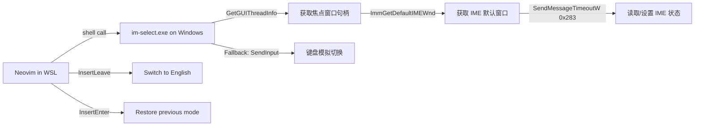
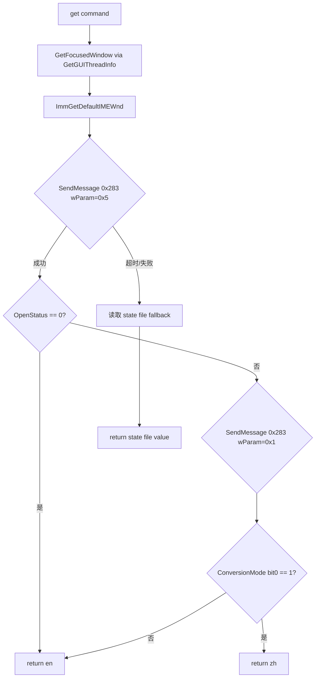
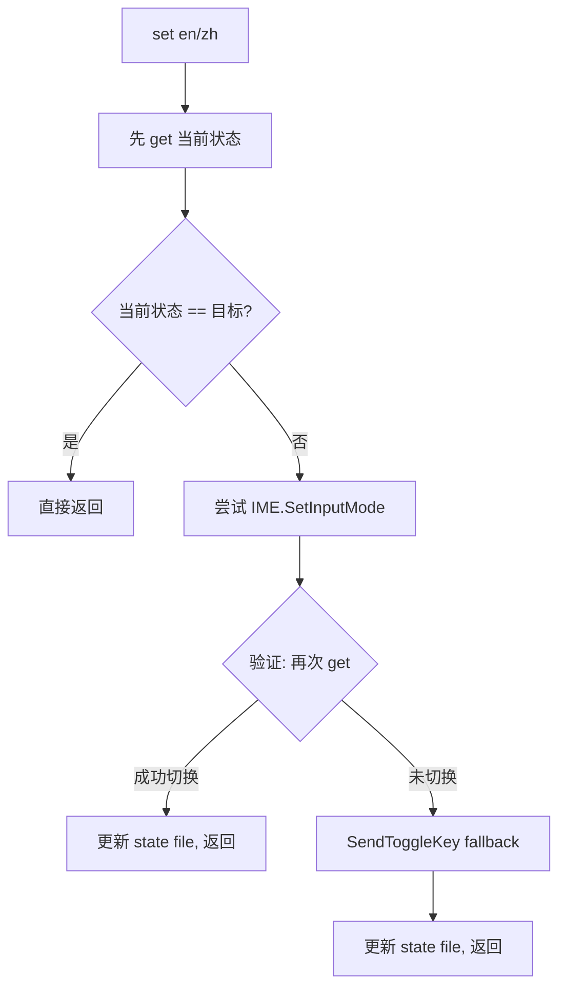

# im-select: WSL Neovim 输入法自动切换方案 (v2 - InputTip 技术方案)

## 概述

在 WSL 中的 Neovim 里，通过 AutoHotkey v2 编写的命令行工具 `im-select.exe`，
实现自动检测和切换 Windows 端输入法（微信输入法、搜狗等）的中英文模式。

v2 方案参考了 [InputTip](https://github.com/abgox/InputTip) 项目的 IME 状态检测技术，
使用 `SendMessageTimeoutW` + `ImmGetDefaultIMEWnd` 替代之前失败的直接 `ImmGetConversionStatus` 调用。

---

## 架构



---

## 核心技术差异: 旧方案 vs 新方案

### 旧方案 (v1 - 已失败)

```
ImmGetContext(hwnd) → ImmGetConversionStatus(hIMC) → 读取 conversion mode
```

问题: 对微信输入法等现代 IME 返回无效值 (-1 或 0)，无法正确检测状态。

### 新方案 (v2 - InputTip 技术)

```
GetGUIThreadInfo() → 获取实际焦点控件 hwnd
ImmGetDefaultIMEWnd(hwnd) → 获取 IME 默认窗口
SendMessageTimeoutW(imeWnd, 0x283, wParam, 0) → 读取/设置状态
```

关键区别:

1. 使用 `GetGUIThreadInfo` 获取真正的焦点控件，而非 `GetForegroundWindow`
2. 通过 `ImmGetDefaultIMEWnd` 获取 IME 窗口句柄
3. 使用 `SendMessageTimeoutW` 发送 `WM_IME_CONTROL` (0x283) 消息
4. 带超时机制，避免阻塞

### WM_IME_CONTROL 消息参数

| wParam | 功能              | 说明                                |
| ------ | ----------------- | ----------------------------------- |
| 0x5    | GetOpenStatus     | 获取状态码 (0=关闭/英文, 非0=开启)  |
| 0x1    | GetConversionMode | 获取切换码 (bit0=1 表示中文模式)    |
| 0x6    | SetOpenStatus     | 设置状态码 (lParam: 0=关闭, 1=开启) |
| 0x2    | SetConversionMode | 设置切换码 (lParam: mode value)     |

### 通用模式判断逻辑

```
if OpenStatus == 0:
    return "en"  # 英文
if ConversionMode & 1:
    return "zh"  # 中文
else:
    return "en"  # 英文
```

---

## Part 1: AutoHotkey v2 命令行工具 im-select.exe

### 命令行接口设计 (不变)

```
im-select.exe [command] [options]

Commands:
  get              输出当前输入法状态: "en" 或 "zh"
  set <en|zh>      切换到指定模式
  toggle           切换中英文
  check            健康检查，输出诊断信息 (JSON格式)

Options:
  --key <keyname>  指定切换键 (默认: RShift)
  --timeout <ms>   SendMessage 超时时间 (默认: 500)
```

### AHK v2 脚本结构 (v2 重构)

```
im-select.ahk
├── IME class
│   ├── GetFocusedWindow()     — GetGUIThreadInfo 获取焦点控件
│   ├── GetOpenStatus(hwnd)    — SendMessageTimeoutW wParam=0x5
│   ├── GetConversionMode(hwnd)— SendMessageTimeoutW wParam=0x1
│   ├── SetOpenStatus(s, hwnd) — SendMessageTimeoutW wParam=0x6
│   ├── SetConversionMode(m, hwnd) — SendMessageTimeoutW wParam=0x2
│   ├── GetInputMode(hwnd)     — 综合判断: OpenStatus + ConversionMode
│   └── SetInputMode(mode, hwnd) — 设置模式: SetOpenStatus + SetConversionMode
├── SendToggleKey(key)         — 键盘模拟回退方案
├── WriteStdout(text)          — 控制台输出 (AttachConsole + WriteFile)
├── Main()                     — 解析命令行参数，执行对应操作
│   ├── get  → IME.GetInputMode() 优先，失败则读 state file
│   ├── set  → IME.SetInputMode() 优先，失败则 SendToggleKey
│   ├── toggle → 先 get 再 set 反向
│   └── check → 输出诊断 JSON
```

### get 命令流程



### set 命令流程



### 输出格式 (不变)

- 标准输出 stdout，纯文本
- `get` 命令输出: `en` 或 `zh`
- `set` / `toggle` 命令输出切换后的状态: `en` 或 `zh`
- `check` 命令输出: JSON 格式的诊断信息

### 编译与部署

- 使用 AHK v2 的 `Ahk2Exe` 编译为独立 exe
- 放置于 `%USERPROFILE%\im-select.exe`
- WSL 中通过 `/mnt/c/Users/<username>/im-select.exe` 调用

---

## Part 2: Neovim 插件 (lazy.nvim 风格) — 无变化

插件 Lua 代码和配置不需要修改，因为 CLI 接口保持不变。

### 插件目录结构

```
im-select.nvim/
├── lua/
│   └── im-select/
│       ├── init.lua        — 插件入口，setup() 函数
│       └── config.lua      — 默认配置
└── README.md
```

---

## Part 3: 文件清单

| 文件                       | 说明                                 |
| -------------------------- | ------------------------------------ |
| `ahk/im-select.ahk`        | AHK v2 源码 (v2 重构，InputTip 技术) |
| `lua/im-select/init.lua`   | 插件主入口                           |
| `lua/im-select/config.lua` | 默认配置                             |
| `README.md`                | 安装和使用文档                       |

---

## 安装流程 (用户视角)

1. 安装 AutoHotkey v2 (如果需要自行编译)
2. 将 `im-select.exe` 放到 `%USERPROFILE%\`
3. 在 Neovim 中通过 lazy.nvim 安装插件:

```lua
{
  'your-username/im-select.nvim',
  event = { 'InsertEnter', 'InsertLeave' },
  opts = {
    toggle_key = 'RShift',
  },
}
```

4. 完成，进出 Insert 模式时自动切换输入法

---

## 参考

- [InputTip](https://github.com/abgox/InputTip) — IME 状态检测技术参考
- [Tebayaki/AutoHotkeyScripts](https://github.com/Tebayaki/AutoHotkeyScripts) — IME.ahk 原始实现
- WM_IME_CONTROL (0x283) — Windows IME 控制消息
- ImmGetDefaultIMEWnd — 获取 IME 默认窗口 API
- GetGUIThreadInfo — 获取线程 GUI 信息（焦点控件）
